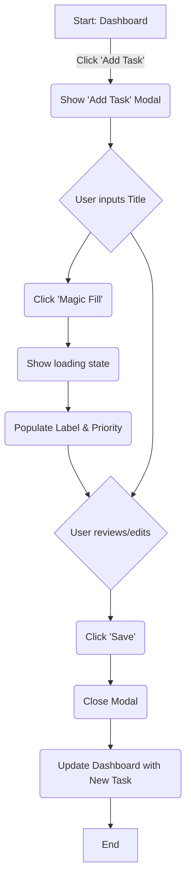

# ibe160 UX Design Specification

_Created on 2025-11-28 by BIP_
_Generated using BMad Method - Create UX Design Workflow v1.0_

---

## Executive Summary

The **Smart To-Do AI (ibe160)** is envisioned as a minimalist, AI-enhanced web application designed to simplify task management. Its core value proposition lies in leveraging AI to automatically suggest task labels and priorities, thereby significantly reducing manual organizational effort. The primary goal is to empower students and beginners to focus on task completion rather than administrative overhead, fostering feelings of efficiency, calmness, and control. The application draws inspiration from the intuitive simplicity of tools like Google Keep and the structured power of Todoist, aiming for a "smart-yet-simple" user experience. The overall UX design complexity is assessed as moderate, balancing straightforward task management with innovative AI integration.

---

## 1. Design System Foundation

### 1.1 Design System Choice

The **TailwindCSS (v3.4.1)** framework will serve as the core design system for the Smart To-Do AI application. This decision is based on the modern, utility-first approach demonstrated in the latest high-fidelity mockups, which allows for rapid, custom UI development.

**Key Benefits of TailwindCSS:**

*   **Utility-First Workflow:** Build custom designs directly in the HTML without writing custom CSS, leading to faster development cycles.
*   **Highly Customizable:** The framework is easily configurable, allowing us to define a bespoke design system (colors, spacing, fonts) that perfectly matches our brand.
*   **Performance:** By automatically removing unused CSS (purging), it produces highly optimized, small production files.
*   **Rich Ecosystem:** Supported by a large community and integrated with modern tools, providing a great developer experience.

### 1.2 TailwindCSS Configuration

To ensure consistent application of the design system, the following `tailwind.config.js` snippet outlines the custom theme extensions for colors, typography, and border-radius.

```javascript
// tailwind.config.js
module.exports = {
  theme: {
    extend: {
      colors: {
        primary: "#607AFB", // From main dashboard.html
        "background-light": "#f5f6f8",
        "background-dark": "#0f1323",
        // Semantic colors (Success, Warning, Error) will be applied directly via utility classes or custom components
      },
      fontFamily: {
        display: ["Sora", "sans-serif"], // From main dashboard.html
      },
      borderRadius: {
        DEFAULT: "0.5rem",
        lg: "1rem",
        xl: "1.5rem",
        full: "9999px",
      },
    },
  },
  // ... other TailwindCSS configurations
};
```

---

## 2. Core User Experience

### 2.1 Defining Experience

The defining experience of the Smart To-Do AI is the "aha!" moment when the application intelligently understands and categorizes a user's task with minimal input. The core user story can be summarized as: **"It's the app where the AI just *gets* what my task is about and organizes it for me."**

This experience is achieved by combining established and novel user experience patterns:

*   **Established Pattern (CRUD):** The application is built upon a standard and universally understood CRUD (Create, Read, Update, Delete) pattern for task management. This ensures a low learning curve for fundamental operations.
*   **Novel Pattern (AI-Suggestion Flow):** The core innovation is the "Magic Fill" interaction. This novel pattern seamlessly integrates AI into the standard task creation/editing flow, allowing users to receive intelligent suggestions for labels and priorities with a single click. This reduces cognitive load and manual effort, delivering the "smart" value proposition.

This blend ensures the app feels both familiar and uniquely intelligent, providing a compelling reason for users to adopt it over simpler or more complex alternatives.

### 2.2 Core Experience Principles

To ensure a cohesive and high-quality user experience, the following core principles will guide all design decisions:

*   **Speed:** The application must feel fast and responsive. Critical interactions, particularly receiving AI suggestions, should feel almost instantaneous (under 2 seconds).
*   **Guidance without Dictation:** The AI should act as an intelligent guide, offering helpful suggestions that accelerate the user's workflow. However, the user must always feel in control.
*   **Flexibility:** Users must have the explicit and easy ability to override, edit, or ignore any AI-generated suggestions, ensuring the tool adapts to their needs.
*   **Subtle Feedback:** System feedback for loading, success, and error states should be immediate, clear, and unobtrusive to maintain a focused and uncluttered user experience.

### 2.3 Novel UX Pattern: The "AI-Suggestion Flow"

The primary novel pattern is the "Magic Fill" interaction, which we will call the **AI-Suggestion Flow**.

*   **Pattern Name:** AI-Suggestion Flow
*   **User Goal:** To categorize and prioritize a task with maximum speed and minimal cognitive load.
*   **Trigger:** User clicks the "Magic Fill" button within the task creation/editing modal.
*   **Interaction Flow:**
    1.  User inputs a task description (e.g., "Finish research paper draft").
    2.  User clicks the "Magic Fill" button.
    3.  A subtle loading indicator appears on the button.
    4.  The AI service is called; upon success, the `Label` and `Priority` fields are populated with the returned suggestions.
    5.  The user can then immediately save or modify the suggestions.
*   **Feedback:**
    *   **Visual:** The button shows a brief loading state. The form fields are populated smoothly. A small, dismissible notification may briefly appear to confirm "AI suggestions applied."
    *   **State Changes:** The application clearly communicates its default, loading, success, and error states in a non-disruptive manner.
*   **Error Handling (Fallback):** If the AI service fails, the system will apply rule-based suggestions and clearly (but subtly) indicate that a fallback was used. The app remains fully functional.
*   **Inspiration:** This pattern is inspired by "Smart Compose" in Gmail and autocomplete suggestions in modern search applications, where suggestions are offered intelligently but can be easily ignored or accepted.

---

## 3. Visual Foundation

### 3.1 Color System

The application will adopt the **Modern & Focused** color theme, centered around shades of blue and indigo. This palette was chosen to evoke feelings of intelligence, calm, and productivity, directly aligning with the core user experience principles.

*   **Primary Color:** A strong blue/indigo will be used for primary calls-to-action, active navigation elements, and key interactive components to guide the user's attention.
*   **Secondary/Accent Color:** A lighter shade of blue or a complementary color will be used for secondary actions and less critical interactive elements.
*   **Semantic Colors:** A standard set of colors will be used to communicate meaning consistently:
    *   **Success:** Green
    *   **Warning:** Yellow/Amber
    *   **Error:** Red
*   **Neutral Grayscale:** A range of grays will be used for text, backgrounds, and borders to create a clean, minimalist, and readable interface.

**High-Fidelity Mockups:**

- High-Fidelity Mockups: [design_mockups/](./design_mockups/)
  *(This directory contains the final design mockups where the color system is applied).*

### 3.2 Typography System

The typography system will prioritize legibility and a clean aesthetic, leveraging Bootstrap's default type scale for responsive headings and body text. A system font stack will be utilized for optimal performance and consistency across devices, ensuring that text is clear and scannable.

*   **Font Families:** System font stack (e.g., `system-ui, -apple-system, "Segoe UI", Roboto, "Helvetica Neue", "Noto Sans", "Liberation Sans", Arial, sans-serif, "Apple Color Emoji", "Segoe UI Emoji", "Segoe UI Symbol", "Noto Color Emoji"`), ensuring broad compatibility and efficient loading.
*   **Type Scale:** Bootstrap's predefined responsive heading sizes (h1-h6) and body text sizes will be used, providing clear visual hierarchy.
*   **Font Weights:** Standard weights (e.g., `normal`, `bold`) will be used judiciously to emphasize important information.
*   **Line Heights:** Bootstrap's default line heights will be maintained to ensure optimal readability.

### 3.3 Spacing and Layout Foundation

The application will adopt a consistent spacing and layout foundation, primarily utilizing Bootstrap's utility classes.

*   **Base Unit:** Bootstrap's `rem`-based spacing scale will be used, providing a consistent and scalable approach to element spacing.
*   **Spacing Scale:** Utility classes like `m-*` (margin) and `p-*` (padding) will be applied consistently for `xs`, `sm`, `md`, `lg`, `xl` values.
*   **Layout Grid:** The responsive 12-column Bootstrap grid system will be the foundation for all page layouts, ensuring adaptability across different screen sizes.
*   **Container Widths:** Bootstrap's `.container` and `.container-fluid` classes will be used to manage content width, providing appropriate margins and maximum widths for readability.

---

## 4. Design Direction

### 4.1 Chosen Design Approach

The application will adopt a **"Spacious & Focused List"** design direction. This approach was selected because it best embodies the core principles of minimalism, clarity, and focus, and directly aligns with the PRD's description of a "Clean card-based list view with a sidebar for Smart Lists."

**Key Characteristics of this Direction:**

*   **Layout:** A two-column layout featuring:
    *   A permanent **sidebar** on the left for primary navigation and "Smart Lists" (e.g., High Priority, Due This Week).
    *   A **main content area** on the right that displays tasks in a single, spacious, card-based list.
*   **Visual Hierarchy:** The design prioritizes generous white space and a clear visual hierarchy. This reduces cognitive load and allows users to easily scan and process their tasks.
*   **Content Organization:** Tasks will be presented as individual cards within a vertical list. Each card will contain the essential task information (title, priority, due date) in a clear and scannable format.
*   **Interaction:** The interaction model will be simple and intuitive. Users can click on a task card to open a modal for editing, and interactive elements will have clear hover and focus states.

**Rationale:** This direction is optimal for our target users (students and beginners) as it avoids the intimidating density of power-user interfaces while providing more structure than a simple grid. It promotes a calm, focused, and efficient user experience.

**High-Fidelity Mockups:**

- **High-Fidelity Mockups:** [design_mockups/](./design_mockups/)
  *(This directory contains the final design mockups that define the chosen design direction).*

---

## 5. User Journey Flows

### 5.1 Critical User Path: Creating a New Task with AI Assistance

This journey is the most critical interaction in the application, as it delivers the core "smart" value proposition. The chosen approach is a **Single-Screen Modal Flow** for speed and to keep the user in the context of their main task list.

*Note: Full coverage of all critical user journeys is dependent on cross-referencing with the Product Requirements Document (PRD). This specification currently details this primary flow.*

*   **User Goal:** To add and categorize a new task as quickly as possible.
*   **Entry Point:** User clicks the "Add Task" button on the main dashboard.

**Flow Steps:**

1.  **Trigger:** User clicks "Add Task."
    *   **System Response:** A modal window appears with a form for `Title` (required), `Notes`, and `Due Date`.
2.  **Input:** User types a description into the `Title` field.
3.  **AI Assistance (Optional)::** User clicks the "Magic Fill" button.
    *   **System Response:** A subtle loading indicator appears on the button. The `Label` and `Priority` fields are then populated with the AI-generated suggestions.
4.  **Review & Save:** User reviews all fields, makes any desired manual adjustments, and clicks "Save."
    *   **System Response:** The modal closes. The new task appears in the main task list. A brief, non-disruptive confirmation (e.g., a toast notification) confirms "Task created."

**Visual Flow (Mermaid Diagram):**



---

## 6. Component Library

### 6.1 Component Strategy

The component library strategy will be utility-first, leveraging **TailwindCSS** to build custom components. This ensures that every component is built consistently from the same design primitives (color palette, spacing scale, etc.) defined in the `tailwind.config.js` file.

While Tailwind provides the building blocks, we will define a set of core, reusable application components.

**Key Application Components (to be built with TailwindCSS):**

*   **Layout:** A two-column layout with a fixed sidebar and main content area.
*   **Navigation:** Sidebar navigation links.
*   **Forms:** Text inputs, select dropdowns, and date pickers as seen in the `edit-taskboard.html` mockup.
*   **Buttons:** Primary, secondary, and tertiary buttons with clear visual hierarchy.
*   **Modals:** A standardized modal structure for adding/editing tasks, managing settings, and creating labels.
*   **Indicators:** Badges for labels and priority levels.
*   **Feedback:** Toast notifications for success/error messages.

**Custom Components:**

The core custom component will be the **Task Card**, which will encapsulate a single task's visual representation and interaction points.

*   **Component Name:** Task Card
*   **Purpose:** To clearly display task information and provide direct interaction for task management within the main task list, as seen in `design_mockups/main-dashboard.html`.
*   **Anatomy:**
    *   **Completion Checkbox:** A large, circular checkbox on the left.
    *   **Task Title & Due Date:** A stacked text block with the title given more prominence.
    *   **Labels/Priority:** Displayed on the right as styled, pill-shaped badges.
    *   **Action Icons:** Hidden by default. A `pencil` (edit) and `trash can` (delete) icon appear on the far right when the user hovers over the card.
*   **States:**
    *   **Default:** Clean, card-based presentation.
    *   **Hover:** The card border becomes slightly more prominent, and the action icons fade into view.
    *   **Completed:** The checkbox is filled, and the title and due date text have a strikethrough effect and a muted color.
*   **Behavior:** Clicking anywhere on the card (except the action icons) will trigger the "Edit Task" modal. Clicking the delete icon will prompt for confirmation.
*   **Accessibility:** Will include appropriate ARIA roles and keyboard navigation support to ensure usability for all.

---

## 7. UX Pattern Decisions

### 7.1 Consistency Rules

To ensure a cohesive and intuitive user experience, the following UX patterns will be applied consistently across the application.

*   **Button Hierarchy:**
    *   **Primary Actions** (e.g., "Save"): Solid fill, high-contrast buttons using the primary brand color.
    *   **Secondary Actions** (e.g., "Cancel"): Subtle outline or plain text buttons to de-emphasize.
    *   **Destructive Actions** (e.g., "Delete"): A distinct red color, used within confirmation dialogs.

*   **System Feedback (Notifications):**
    *   **Pattern:** Non-blocking, auto-dismissing "toast" notifications will be used for success, error, and informational messages.
    *   **Loading States:** In-context spinners on buttons or other interactive elements will indicate that a process is running.

*   **Form Patterns:**
    *   **Labels:** Will be placed directly above input fields for clarity.
    *   **Validation:** Field validation will occur on blur (when a user leaves the field) and on form submission. Error messages will appear inline, below the relevant field.

*   **Modal Patterns:**
    *   **Dismissal:** Modals for adding or editing tasks can be dismissed by clicking a "Cancel" button, pressing the `Escape` key, or clicking the modal backdrop.

*   **Navigation Patterns:**
    *   **Active State:** The active page or filter in the sidebar navigation will be clearly indicated with a solid background color and contrasting text.

*   **Empty State Patterns:**
    *   When a task list is empty, the view will display a helpful message, an icon, and a clear call-to-action to encourage user engagement (e.g., an "Add Task" button).

*   **Confirmation Patterns:**
    *   Destructive actions, most notably deleting a task, will require explicit user confirmation through a modal dialog to prevent accidental data loss.

*   **Search Patterns:**
    *   **Specification:** Search inputs will feature a clear magnifying glass icon, a placeholder text (e.g., "Search tasks..."), and a clear button or 'X' icon to clear the search query.
    *   **Usage Guidance:** Primarily used for filtering task lists or searching within specific data sets. Should be accessible and provide immediate feedback as the user types (live filtering).
    *   **Examples:** Integrated search bar at the top of task lists, filter inputs within modals.

*   **Date/Time Patterns:**
    *   **Specification:** Date inputs will utilize a standardized date picker component (e.g., a calendar modal). Time inputs will use a 12-hour format with AM/PM selection, or a 24-hour format if preferred by the user in settings.
    *   **Usage Guidance:** Used for setting due dates, reminders, or scheduling tasks. Defaults should be sensible (e.g., tomorrow for a new task due date).
    *   **Examples:** Date input in the "Add/Edit Task" modal, calendar view for task scheduling.

---

## 8. Responsive Design & Accessibility

### 8.1 Responsive Strategy

The application will implement a robust responsive design, adapting its layout and interaction patterns to provide an optimal experience across desktop, tablet, and mobile devices, leveraging Tailwind's breakpoint system.

*   **Desktop (Large Screens):** The primary two-column layout will feature a persistent sidebar for navigation and Smart Lists, with the main content area displaying tasks in a spacious, card-based list.
*   **Tablet (Medium Screens):** The sidebar will collapse into an **offcanvas menu**, accessible via a hamburger icon, maximizing the content area for task viewing. Task cards will adapt to fill the wider viewport.
*   **Mobile (Small Screens):** The offcanvas menu will be the primary navigation. Task cards will stack vertically, ensuring clear readability and easy interaction with touch targets appropriately sized.

### 8.2 Accessibility Strategy

Adhering to the PRD's mandate, the application will target **WCAG 2.1 Level AA compliance** for its core user flows, ensuring usability for a diverse audience, including users with disabilities.

*   **Compliance Target:** WCAG 2.1 Level AA.
*   **Key Requirements:**
    *   **Color Contrast:** All text and interactive elements will meet WCAG AA contrast ratios.
    *   **Keyboard Navigability:** Full keyboard support for all interactive components.
    *   **Visible Focus Indicators:** Clear visual cues to indicate the currently focused element.
    *   **Semantic HTML & ARIA:** Use of appropriate semantic HTML and ARIA attributes for enhanced screen reader compatibility.
    *   **Descriptive Alt Text:** Meaningful alternative text for all informational images.
    *   **Form Accessibility:** Proper labeling and error handling for all form inputs.
    *   **Touch Target Size:** Interactive elements will ensure a minimum touch target size of 44x44 CSS pixels for mobile devices.
*   **Testing Strategy:** Accessibility will be verified through automated tools (e.g., Lighthouse, axe DevTools) and manual testing (e.g., keyboard-only navigation, screen reader checks).

---

## 9. Implementation Guidance

### 9.1 Completion Summary

Excellent work! Your UX Design Specification is complete.

**What we created together:**

-   **Design System:** Tailwind with custom Task Card component
-   **Visual Foundation:** Modern & Focused (Blue/Indigo) color theme with Bootstrap defaults typography and spacing system
-   **Design Direction:** Spacious & Focused List - two-column layout with sidebar and card-based tasks - This direction fosters a minimalist, clean, and intuitive user experience by providing a clear visual hierarchy and ample whitespace, while effectively organizing tasks in a scannable, card-based list.
-   **User Journeys:** 1 critical flow designed with clear navigation paths
-   **UX Patterns:** 7 consistency rules established for cohesive experience
-   **Responsive Strategy:** 3 breakpoints with adaptation patterns for all device sizes
-   **Accessibility:** WCAG 2.1 Level AA compliance requirements defined

**Your Deliverables:**
-   UX Design Document: docs/ux-design-specification.md
-   Interactive Mockups (Color Themes & Design Directions): docs/design_mockups/

**What happens next:**
-   Designers can create high-fidelity mockups from this foundation
-   Developers can implement with clear UX guidance and rationale
-   All your design decisions are documented with reasoning for future reference

You've made thoughtful choices through visual collaboration that will create a great user experience. Ready for design refinement and implementation!

---

## Appendix

### Related Documents

- Product Requirements: `docs/prd.md`
- Product Brief: `docs/product-brief.md`
- Brainstorming: `docs/fase-1-analysis/brainstorming.md`

### Core Interactive Deliverables

This UX Design Specification was created through visual collaboration:

-   **Interactive Mockups**: `docs/design_mockups/`
    -   Interactive HTML showing both color theme applications and design approaches.
    -   Multiple HTML files represent different screens/modals, demonstrating color usage and design directions.
    -   Side-by-side comparison of themes and approaches is implicit through viewing different files.

### Optional Enhancement Deliverables

_This section will be populated if additional UX artifacts are generated through follow-up workflows._

<!-- Additional deliverables added here by other workflows -->

### Next Steps & Follow-Up Workflows

This UX Design Specification can serve as input to:

-   **Wireframe Generation Workflow** - Create detailed wireframes from user flows
-   **Figma Design Workflow** - Generate Figma files via MCP integration
-   **Interactive Prototype Workflow** - Build clickable HTML prototypes
-   **Component Showcase Workflow** - Create interactive component library
-   **AI Frontend Prompt Workflow** - Generate prompts for v0, Lovable, Bolt, etc.
-   **Solution Architecture Workflow** - Define technical architecture with UX context

### Version History

| Date         | Version | Changes                         | Author |
| :----------- | :------ | :------------------------------ | :----- |
| 2025-11-28 | 1.0     | Initial UX Design Specification | BIP    |

---

_This UX Design Specification was created through collaborative design facilitation, not template generation. All decisions were made with user input and are documented with rationale._